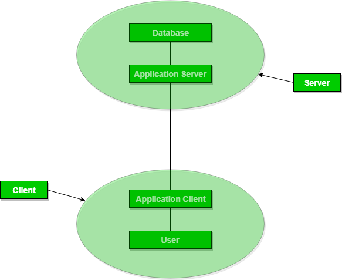
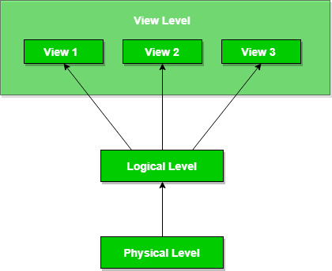
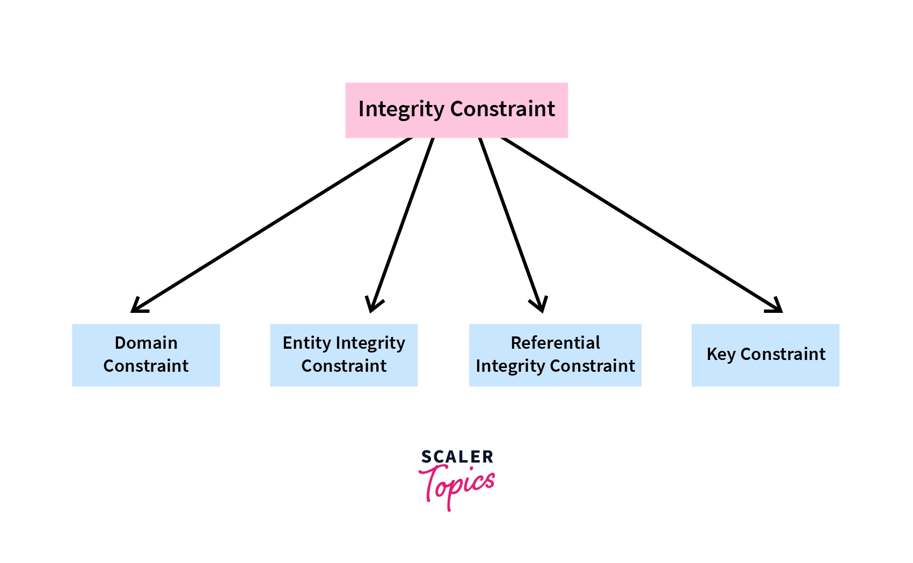
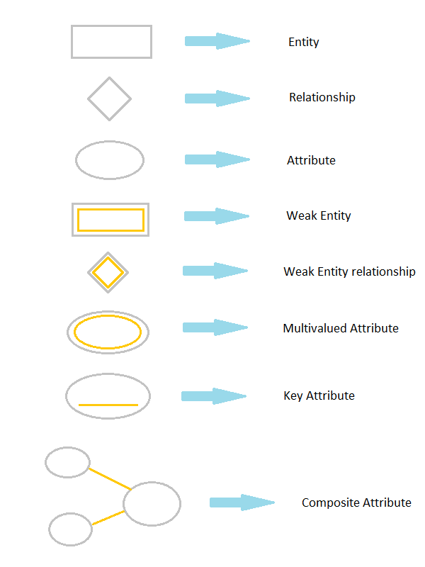
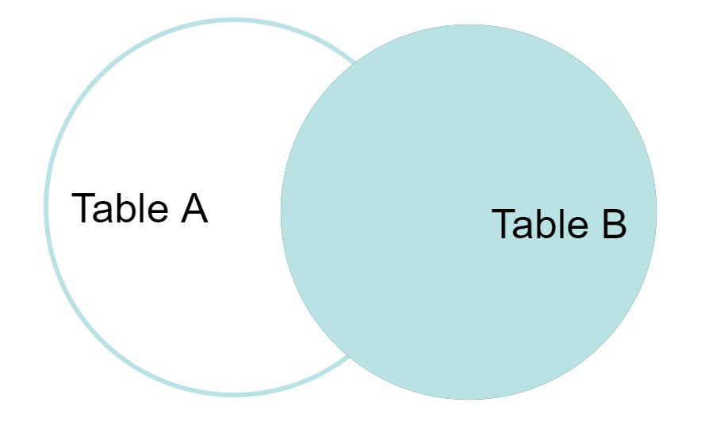

# DBMS

**What is Database**
The database is a collection of inter-related data which is used to retrieve, insert and delete the data efficiently. It is also used to organize the data in the form of a table, schema, views, and reports, etc.

**Characteristics of DBMS**
- Database management system is a software which is used to manage the database.
- It provides protection and security to the database.
- It contains ACID(Atomicity,Consistency,Isolation and Durability) properties which maintain data in a healthy state in case of failure.
- It can provide a clear and logical view of the process that manipulates data.

## DBMS Architecture

DBMS Architecture helps users to get their requests done while connecting to the database. We choose database architecture depending on several factors like the size of the database, number of users, and relationships between the users.

### 1-Tier Architecture

- the database is directly available to the user
- the client, server, and Database are all present on the same machine

- Any changes done here will directly be done on the database itself. It doesn't provide a handy tool for end users.

### 2-Tier Architecture
- The 2-tier architecture is similar to a basic client-server model.The application at the client end directly communicates with the database on the server side.

- The application on the client side establishes a connection with the server side in order to communicate with the DBMS

- this model gives poor performance when there are a large number of users. 

### 3-Tier Architecture

- The client does not directly communicate with the server. Instead, it interacts with an application server which further communicates with the database system



## Data Abstraction

Data abstraction is the process of hiding irrelevant or unwanted data from the end user. This is done to provide an abstract view of the data and to make it easier for users to access the data they need 

The main purpose of data abstraction is to achieve data independence in order to save the time and cost required when the database is modified or altered. 

``There are mainly 3 levels of data abstraction:``

**Physical**
- This is the lowest level of data abstraction. It tells us how the data is actually stored in memory.

**Logical**
- This level comprises the information that is actually stored in the database in the form of tables.
- It also stores the relationship among the data entities

**View**
- This is the highest level of abstraction
- Users view data in the form of rows and columns. Tables and relations are used to store data
- Multiple views of the same database may exist.
- Users can just view the data and interact with the database, storage and implementation details are hidden from them.



## Data Independence in DBMS

The ability to modify the schema definition of a DBMS at one level, without affecting the schema definition of the next higher level is called data independence.

``Types of Data Independence in DBMS``

**Physical Data Independence**

- the ability to modify the physical schema of the database without the modification causing any changes in the logical/conceptual or view/external level.

-  It allows you to describe the database logically without needing to identify physical structures.

**Logical Data Independence**

- The ability to modify logical schema without causing any unwanted modifications to the external schema or the application programs to be rewritten.

-Makes sure that if we make modifications to the table format, the data should not be affected.

```Since the view or external level is the highest level, there is no data independence type associated with it, because there are no levels above it.```

## Integrity Constraints

Integrity constraints are pre-defined set of rules that are applied on the table fields(columns) or relations to ensure that the overall validity, integrity, and consistency of the data present in the database table is maintained.



**Domain Constraint**

- Domain constraints can be defined as the definition of a valid set of values for an attribute.

- The data type of domain includes string, character, integer, time, date, currency, etc. The value of the attribute must be available in the corresponding domain.

**Entity integrity constraints**

- The entity integrity constraint states that primary key value can't be null.

- The entity integrity constraint states that primary key value can't be null.

**Referential Integrity Constraints**

- It ensures that there must always exist a valid relationship between two relational database tables

- This valid relationship between the two tables confirms that a foreign key exists in a table.It should always reference a corresponding value or attribute in the other table or be null.

**Key constraint**

- Keys are the entity set that is used to identify an entity within its entity set uniquely.

- An entity set can have multiple keys, but out of which one key will be the primary key.

### Data Model

Data models are used to describe how the data is stored, accessed, and updated in a DBMS. It provides a set of conceptual tools that are vastly used to represent the description of data.

**Conceptual Data Model**

- This type of model designs the data in the form of rows and columns within a table

**Entity-Relationship Data Model**

- An ER model is the logical representation of data as objects and relationships among them.These objects are known as entities, and relationship is an association among these entities.

``Components of ER Model:``

1. Entity: An entity is referred to as a real-world object.

- An entity that depends on another entity called a **weak entity**. The weak entity doesn't contain any key attribute of its own

2. Attributes: An attribute can be defined as the 
description of the entity.

- The **key attribute** is used to represent the main characteristics of an entity. It represents a primary key

- An attribute that composed of many other attributes is known as a **composite attribute**.

- An attribute can have more than one value. These attributes are known as a **multivalued attribute**

- An attribute that can be derived from other attribute is known as a **derived attribute**

3. Relationship: Relationships are used to define relations among different entities.

- When only one instance of an entity is associated with the relationship, then it is known as **one to one relationship**.

- When only one instance of the entity on the left, and more than one instance of an entity on the right associates with the relationship then this is known as a **one-to-many relationship**.

- When more than one instance of the entity on the left, and only one instance of an entity on the right associates with the relationship then it is known as a **many-to-one relationship**.

- When more than one instance of the entity on the left, and more than one instance of an entity on the right associates with the relationship then it is known as a **many-to-many relationship**.

**ER (Entity Relationship) Diagram in DBMS**

- In ER modeling, the database structure is portrayed as a diagram called an entity-relationship diagram.




**Representational Data Model**

- This type of data model is used to represent only the logical part of the database and does not represent the physical structure of the database

-  A popular representational model is a Relational model.

- It is a theoretical concept whose practical implementation is done in Physical Data Model. 

## Relational Model in DBMS

The relational model represents how data is stored in Relational Databases. A relational database consists of a collection of tables

``Important Terminologies``

- Attribute: Attributes are the properties that define an entity.

- Relation Schema: A relation schema defines the structure of the relation and represents the name of the relation with its attributes

- Tuple: Each row in the relation is known as a tuple.

- Relation Instance: The set of tuples of a relation at a particular instance of time is called a relation instance.

- Degree: The number of attributes in the relation is known as the degree of the relation.

- Cardinality: The number of tuples in a relation is known as cardinality.

- Column: The column represents the set of values for a particular attribute

- Relation Key: These are basically the keys that are used to identify the rows uniquely or also help in identifying tables.

**Primary key**

A primary key constraint depicts a key comprising one or more columns that will help uniquely identify every tuple/record in a table

- No duplicate values are allowed
- NO NULL values are present in column with Primary key.
- Only one primary key per table exist although Primary key may have multiple columns.
- No new row can be inserted with the already existing primary key.

**candidate key**

A candidate key is a minimal set of attributes that uniquely identifies each tuple within a table

- Candidate specifies the key which can qualify for primary key.

- Candidate key any attribute can contain NULL value
- While in a relation there can be more than one candidate key.

**Super Key**

Super Key is an attribute (or set of attributes) that is used to uniquely identifies all attributes in a relation.

- Various super keys together makes the criteria to select the candidate keys.

- All super keys can’t be candidate keys but the reverse is true

**Foreign Key**

 A foreign key is a column or a group of columns used to identify a row uniquely of a different table

``Anomalies in the Relational Model``

An anomaly is an irregularity or something which deviates from the expected or normal state

**Updation / Update Anomaly**
When we update some rows in the table, and if it leads to the inconsistency of the table then this anomaly occurs. This type of anomaly is known as an updation anomaly.

**Insertion Anomaly**
If there is a new row inserted in the table and it creates the inconsistency in the table then it is called the insertion anomaly

**Deletion Anomaly**
If we delete some rows from the table and if any other information or data which is required is also deleted from the database, this is called the deletion anomaly in the database

## Functional Dependency

The functional dependency is a relationship that exists between two attributes.

In any relation ,a functional dependency A->B holds if-
            Two tuples having same value of attributes A also have the same value for attribute B.

- It typically exists between the primary key and non-key attribute within a table.

- The left side of FD is known as a determinant, the right side of the production is known as a dependent.

**Trivial Functional Dependency**

A dependent is always a subset of the determinant. i.e. If X → Y and Y is the subset of X, then it is called trivial functional dependency

**In Non-trivial functional dependency**

The dependent is strictly not a subset of the determinant. i.e. If X → Y and Y is not a subset of X, then it is called Non-trivial functional dependency.

**Transitive Functional Dependency**

In transitive functional dependency, dependent is indirectly dependent on determinant. i.e. If a → b & b → c, then according to axiom of transitivity, a → c.

**Full functional dependency**

It occurs when a set of attributes determines the value of every other attribute in the table.

**Partial Functional Dependency**

In partial functional dependency a non key attribute depends on a part of the composite key, rather than the whole key. If a relation R has attributes X, Y, Z where X and Y are the composite key and Z is non key attribute. Then X->Z is a partial functional dependency in RBDMS.

**Inference Rule**

- Reflexivity: if B is a subset of A,then A->B always hold.
- Transitivity: if A->B and B->C,then A->C always hold.
- Augmentation: if A->B,then AC->BC holds.
- Decomposition: if A->BC,then A->B and A->C always hold.
- Composition: if A->B and C->D,then AC->BD always hold.
- Additive: if A->B and A->C,then A->BC always hold.

``A functional dependency X->Y will always hold if all the values of X are unique irrespective of value of Y.``

``A functional dependency X->Y will always hold if all the values of Y are unique irrespective of value of X.``

``For a functional dependency X->Y,violation will occur only when for two or more same values of X,the corresponding Y values are different.``


## Normalization

- Normalization is the process of organizing the data in the database.

- Normalization is used to minimize the redundancy from a relation or set of relations. It is also used to eliminate undesirable characteristics like Insertion, Update, and Deletion Anomalies

- Normalization divides the larger table into smaller and links them using relationships.

- The normal form is used to reduce redundancy from the database table.

### 1st Normal Form.

**Rules of 1st Normal Form**
- Each table should contain a single value.
- Each record needs to be unique.

Note:

```By default,every relation is in 1NF.This is because formal definition of a relation states that value of all the attribute must be atomic```

### 2nd Normal Form.

**Rules of 2nd Normal Form**

- The table should be in 1NF.
- Primary Key does not functionally dependent on any subset of Candidate Key.i.e.. No partial dependency exists in the relation.


### 3rd Normal Form.

**Rules of 3rd Normal Form**

- The tables should be in 2NF.
- There will be no Transitive Dependency.


### Boyce-Codd Normal Form-

A given relation is called in BCNF if and only if-

1. Relation already exists in 3NF.
2. For each non-trivial functional dependency A → B, A is a super key of the relation.


**Canonical Cover in DBMS**

InDBMS,

● A canonical cover is a simplified and reduced version of the given set of functional
dependencies.

● Since it is a reduced version, it is also called as Irreducible set.

**Characteristics-**

● Canonical cover is free from all the extraneous functional dependencies.

● The closure of canonical cover is same as that of the given set of functional
dependencies.

● Canonical cover is not unique and may be more than one for a given set of
functional dependencies.

Need-

● Working with the set containing extraneous functional dependencies increases the
computation time.

● Therefore, the given set is reduced by eliminating the useless functional
dependencies.

● This reduces the computation time and working with the irreducible set becomes
easier.

**Steps To Find Canonical Cover-**

Step-01:

Write the given set of functional dependencies in such a way that each functional
dependency contains exactly one attribute on its right side.


## SQL Queries

### Data Definition Language (DDL) Statements

**CREATE Statement**

- Used to create database objects like tables, views, and indexes.

- Syntax: CREATE TABLE table_name (column1 datatype, column2 datatype, ...);

**ALTER Statement**

- Used to modify existing database objects.

- Syntax: ALTER TABLE table_name ADD column_name datatype;

**DROP Statement**

- Used to delete database objects.

- Syntax: DROP TABLE table_name;
Data Manipulation Language (DML) Statements

**INSERT Statement**

- Used to insert new records into a table.

- Syntax: INSERT INTO table_name (column1, column2, ...) VALUES (value1, value2, ...);

**UPDATE Statement**

- Used to modify existing records in a table.

- Syntax: UPDATE table_name SET column1 = value1, column2 = value2 WHERE condition;

**DELETE Statement**

- Used to delete records from a table.

- Syntax: DELETE FROM table_name WHERE condition;

**Simple Queries with WHERE Clause**

WHERE Clause

- Used to filter records based on a specified condition.

- Example: SELECT * FROM employees WHERE department = 'HR';

**Compound WHERE Clause with Multiple AND & OR Conditions**

AND Condition

- Used to combine multiple conditions where all must be true.

- Example: SELECT * FROM products WHERE category = 'Electronics' AND price < 500;

OR Condition

- Used to combine multiple conditions where at least one must be true.

- Example: SELECT * FROM orders WHERE status = 'Shipped' OR status = 'Processing';

**SQL | Join**

SQL Join statement is used to combine data or rows from two or more tables based on a common field between them.

**INNER JOIN**

The INNER JOIN keyword selects all rows from both the tables as long as the condition is satisfied. This keyword will create the result-set by combining all rows from both the tables where the condition satisfies i.e value of the common field will be the same. 

```Syntax: 

SELECT table1.column1,table1.column2,table2.column1,....
FROM table1 
INNER JOIN table2
ON table1.matching_column = table2.matching_column;
```

Note: 

```We can also write JOIN instead of INNER JOIN. JOIN is same as INNER JOIN. ```


**LEFT JOIN**

This join returns all the rows of the table on the left side of the join and matches rows for the table on the right side of the join. For the rows for which there is no matching row on the right side, the result-set will contain null. LEFT JOIN is also known as LEFT OUTER JOIN.

Syntax: 
```
SELECT table1.column1,table1.column2,table2.column1,....
FROM table1 
LEFT JOIN table2
ON table1.matching_column = table2.matching_column;
```

Note:
``` We can also use LEFT OUTER JOIN instead of LEFT JOIN, both are the same.```


**RIGHT JOIN**

RIGHT JOIN is similar to LEFT JOIN. This join returns all the rows of the table on the right side of the join and matching rows for the table on the left side of the join. For the rows for which there is no matching row on the left side, the result-set will contain null. RIGHT JOIN is also known as RIGHT OUTER JOIN. 

Syntax: 
```
SELECT table1.column1,table1.column2,table2.column1,....
FROM table1 
RIGHT JOIN table2
ON table1.matching_column = table2.matching_column;
```
Note:
``` We can also use RIGHT OUTER JOIN instead of RIGHT JOIN, both are the same.```.



**Sub-queries**


Sub-queries

- A query nested within another query.

Example:
```
SELECT product_name
FROM products
WHERE category_id IN (SELECT category_id FROM categories WHERE category_name = 'Electronics'); 
```

**Correlated Sub-queries**

- A sub-query that depends on values from the outer query.

Example:
```
SELECT employee_name
FROM employees e
WHERE salary > (SELECT AVG(salary) FROM employees WHERE department = e.department);
```

**Data Control Language (DCL) Statements**

**GRANT Statement**

- Used to grant permissions to users or roles.

- Syntax: GRANT privilege ON object TO user_or_role;

**REVOKE Statement**

- Used to revoke permissions previously granted.

- Syntax: REVOKE privilege ON object FROM user_or_role;


## Decomposition

Decomposition in Database Management System is to break a relation into multiple relations to bring it into an appropriate normal form. It helps to remove redundancy, inconsistencies, and anomalies from a database

**Lossless Join Decomposition**

A lossless Join decomposition ensures two things:

- No information is lost while decomposing from the original relation.

- If we join back the sub decomposed relations, the same relation that was decomposed is obtained.

We can follow certain rules to ensure that the decomposition is a lossless join decomposition.if any of these condition fail,then the decomposition is lossy.

Let’s say we have a relation R and we decomposed it into R1 and R2, then the rules are:

1. The union of attributes of both the sub relations R1 and R2 must contain all the attributes of original relation R.

R1 ∪ R2 = R

2. The intersection of attributes of both the sub relations R1 and R2 must not be null, i.e., there should be some attributes that are present in both R1 and R2.

R1 ∩ R2 ≠ ∅

3. The intersection of attributes of both the sub relations R1 and R2 must be the superkey of R1 or R2, or both R1 and R2.

R1 ∩ R2 = Super key of R1 or R2

**Dependency Preserving**

The second property of lossless decomposition is dependency preservation which says that after decomposing a relation R into R1 and R2, all dependencies of the original relation R must be present either in R1 or R2 or they must be derivable using the combination of functional dependencies present in R1 and R2.

## PL/SQL

Pl/SQL stands for "Procedural Language extension of SQL" that is used in Oracle.

PL/SQL is a block structured language.

A block has the following structure:
```
DECLARE
    declaration statements;

BEGIN
    executable statements

EXCEPTIONS
    exception handling statements

END;
```

**PL/SQL Variables**

 A variable is named storage location that stores a value of a particular data type.

**Variable Declaration in PL/SQL**

- The variables should be declared in the declaration section of the PL/SQL code block structure.

-  It can also be declared in a package as a global variable. 

- When a variable is declared, PL/SQL allocates memory to the variable and stores the desired type value and the storage location is identified by the variable name.

The syntax for declaring a variable is −

``variable_name [CONSTANT] datatype [NOT NULL] [:= | DEFAULT initial_value] ``

**Initializing Variables in PL/SQL:**


Variable declaration in PL/SQL assigns it a default value NULL. If we want to initialize a variable with a not NULL value, we can do this during the variable declaration, using of the following keywords −

- The DEFAULT keyword
- The assignment operator(=)

For example −
```
counter binary_integer := 0; 
greetings varchar2(20) DEFAULT 'Have a Good Day';
```

**Variable Scope in PL/SQL:**

- Local variables − the variables declared inside an inner block and is not accessible to outer blocks.

- Global variables − the variables declared in the outermost block or in a package as global variable.

**The PL/SQL Identifiers**

- PL/SQL identifiers are constants, variables, exceptions, procedures, cursors, and reserved words that cannot be used for other programs. 

- Identifiers are not case-sensitive

- it should be in the length of 30 characters.

**PL/SQL Literals**

A literal is a particular numeric, character, string, or Boolean value which is not represented by an identifier. For example, TRUE, FALSE, 2021, NULL

**PL/SQL Operators**

An operator is a symbol that tells the compiler to perform some specific mathematical or logical operations

- Arithmetic Operators (+,-,*,/,**)
- Relational Operators (=,>,<,<=,>=,=< >~=not equals to)
- Comparison Operators (BETWEEN, IS NULL,IN, LIKE)
- Logical Operators (AND,OR,NOT)


**PL/SQL If**

PL/SQL supports the programming language features like conditional statements and iterative statements.

Syntax for IF Statement:

```
IF condition   
THEN   
Statement: {It is executed when condition is true}  
END IF; 
 ```

 Syntax: (IF-THEN-ELSE statement):

```
IF condition   
THEN  
   {...statements to execute when condition is TRUE...}  
ELSE  
   {...statements to execute when condition is FALSE...}  
END IF;   

```

Syntax: (IF-THEN-ELSIF statement):

```
IF condition1   
THEN  
   {...statements to execute when condition1 is TRUE...}  
ELSIF condition2   
THEN  
   {...statements to execute when condition2 is TRUE...}  
END IF;
  ```

Syntax: (IF-THEN-ELSIF-ELSE statement):

```
IF condition1   
THEN  
   {...statements to execute when condition1 is TRUE...}  
ELSIF condition2   
THEN  
   {...statements to execute when condition2 is TRUE...}  
ELSE  
   {...statements to execute when both condition1 and condition2 are FALSE...}  
END IF; 
 ```

 **PL/SQL Case Statement**

 The PL/SQL CASE statement facilitates you to execute a sequence of satatements based on a selector. A selector can be anything such as variable, function or an expression that the CASE statement checks to a boolean value.

 Syntax for the CASE Statement:

```
CASE [ expression ]  
WHEN condition_1 THEN result_1  
   WHEN condition_2 THEN result_2  
   ...  
   WHEN condition_n THEN result_n  
 ELSE result  
END   
```

**PL/SQL Loop**

The PL/SQL loops are used to repeat the execution of one or more statements for specified number of times

Syntax for a basic loop:
```
LOOP  
  Sequence of statements;  
END LOOP;  
```
**PL/SQL Exit Loop (Basic Loop)**

Syntax of exit loop:
```
LOOP   
   statements;   
   EXIT;   
   {or EXIT WHEN condition;}  
END LOOP;  
```

**PL/SQL While Loop**

Syntax of while loop:
```
WHILE <condition>   
 LOOP statements;   
END LOOP;  
```

**PL/SQL FOR Loop**

Syntax of for loop:

```
FOR counter IN initial_value .. final_value LOOP  
  LOOP statements;   
END LOOP;
```
**PL/SQL Continue Statement**

The continue statement is used to exit the loop from the reminder if its body either conditionally or unconditionally and forces the next iteration of the loop to take place, skipping any codes in between.

**PL/SQL GOTO Statement**

In PL/SQL, GOTO statement makes you able to get an unconditional jump from the GOTO to a specific executable statement label in the same subprogram of the PL/SQL block.

Syntax:
```
GOTO label_name;  
 ..  
..  
<<label_name>>  
Statement;  
```
Restriction on GOTO statement


- Cannot transfer control into an IF statement, CASE statement, LOOP statement or sub-block.

- Cannot transfer control from one IF statement clause to another or from one CASE statement WHEN clause to another.

- Cannot transfer control from an outer block into a sub-block.

- Cannot transfer control out of a subprogram.

- Cannot transfer control into an exception handler.


## Transaction

Transaction are set of operationto perform logical set of work.

- Tansaction usually means that the data in the database has changed

``some terminologies``

- Read/Access data (R): Accessing the database item from disk (where the database stored data) to memory variable.

- Write/Change data (W): Write the data item from the memory variable to the disk.

- Commit: Commit is a transaction control language that is used to permanently save the changes done in a transaction

- If the transaction is failed anywhere before committing we have to go back and start from the beginning. We can’t continue from the same state. This is known as **Roll Back**

**Properties of Transaction (ACID Properties)**

- Atomicity : Either all operation of the transaction are reflected properly in database ,or none are.

- Consistency : No transaction execute concurrently

- Isolation : Each transaction is unaware of other transaction executing concurrently in the sysytem.

- Durability : After a transaction is completed successfully ,the changes it has made to the database persist,even if there are system failures.

**Transaction States**


**Schedule**

A schedule is defined as an execution sequence of transactions

- **Serial Schedules** : A serial schedule is one in which no transaction starts until a running transaction has ended are called serial schedules.

- **Non-Serial Schedule** :  In the non-serial schedule, the other transaction proceeds without waiting for the previous transaction to complete, keeping the end result correct and same as the serial schedule

### Serializability

- serializability is a way to check if the execution of two or more transactions are maintaining the database consistency or not.

- A schedule is serialized if it is equivalent to a serial schedule

**conflict serializable**

A schedule is called conflict serializable if it can be transformed into a serial schedule by swapping non-conflicting operations.

``Conflicting operations pair (R1(A), W2(A)) , (W1(A), W2(A)) and (W1(A), R2(A))``

`` non-conflicting pairs (R1(A), W2(B)) , ((W1(A), W2(B)) ``

A **Precedence Graph** or Serialization Graph is used commonly to test the Conflict Serializability of a schedule

**Steps to Construct a Precedence Graph**

Step 1: Draw a node for each transaction in the schedule.

Step 2: For each pair of conflicting operations (i.e., operations on the same data item by different transactions), draw an edge from the transaction that performed the first operation to the transaction that performed the second operation. The edge represents a dependency between the two transactions.

Step 3: If there are multiple conflicting operations between two transactions, draw multiple edges between the corresponding nodes.

Step 4: If there are no conflicting operations between two transactions, do not draw an edge between them.

Step 5: Once all the edges have been added to the graph, check if the graph contains any cycles. If the graph contains cycles, then the schedule is not conflict serializable. Otherwise, the schedule is conflict serializable.

The serial schedule S’ can be found by **Topological Sorting** of the acyclic precedence graph

Step 1. Look for vertices with indegree 0.Pick it.
Step 2. Remove that vertices and then repeat the step 1.


**View-equivalent**

Two schedules are view-equivalent if they produce the same results regardless of the order in which non-conflicting operations are executed, and the order of conflicting operations is the same in both schedules.


**Recoverable Schedule**

Schedules in which transactions commit only after all transactions whose changes they read commit are called recoverable schedules.

**Cascading Schedule**

When there is a failure in one transaction and this leads to the rolling back or aborting other dependent transactions, then such scheduling is referred to as Cascading rollback or cascading abort

**Cascadeless Schedule**

Schedules in which transactions read values only after all transactions whose changes they are going to read commit are called cascadeless schedules.

**Lock-Based Protocol**

In this type of protocol, any transaction cannot read or write data until it acquires an appropriate lock on it.

1. **Shared lock**

- In a shared lock, the data item can only read by the transaction.

- It can be shared between the transactions because when the transaction holds a lock, then it can't update the data on the data item.

2. **Exclusive lock**

- In the exclusive lock, the data item can be both reads as well as written by the transaction.

- This lock is exclusive, and in this lock, multiple transactions do not modify the same data simultaneously.

**Simplistic lock protocol**

It is the simplest way of locking the data while transaction. Simplistic lock-based protocols allow all the transactions to get the lock on the data before insert or delete or update on it. It will unlock the data item after completing the transaction.

**Pre-claiming Lock Protocol**

- Pre-claiming Lock Protocols evaluate the transaction to list all the data items on which they need locks.

- Before initiating an execution of the transaction, it requests DBMS for all the lock on all those data items.

- If all the locks are granted then this protocol allows the transaction to begin. When the transaction is completed then it releases all the lock.

- If all the locks are not granted then this protocol allows the transaction to rolls back and waits until all the locks are granted.

**Two-phase locking (2PL)**

- The two-phase locking protocol divides the execution phase of the transaction into three parts.

- In the first part, when the execution of the transaction starts, it seeks permission for the lock it requires.

- In the second part, the transaction acquires all the locks. The third phase is started as soon as the transaction releases its first lock.

- In the third phase, the transaction cannot demand any new locks. It only releases the acquired locks.

There are two phases of 2PL:

**Growing phase**: In the growing phase, a new lock on the data item may be acquired by the transaction, but none can be released.

**Shrinking phase**: In the shrinking phase, existing lock held by the transaction may be released, but no new locks can be acquired.

**Strict Two-phase locking (Strict-2PL)**

- The first phase of Strict-2PL is similar to 2PL. In the first phase, after acquiring all the locks, the transaction continues to execute normally.

- The only difference between 2PL and strict 2PL is that Strict-2PL does not release a lock after using it.

- Strict-2PL waits until the whole transaction to commit, and then it releases all the locks at a time.

- Strict-2PL protocol does not have shrinking phase of lock release.